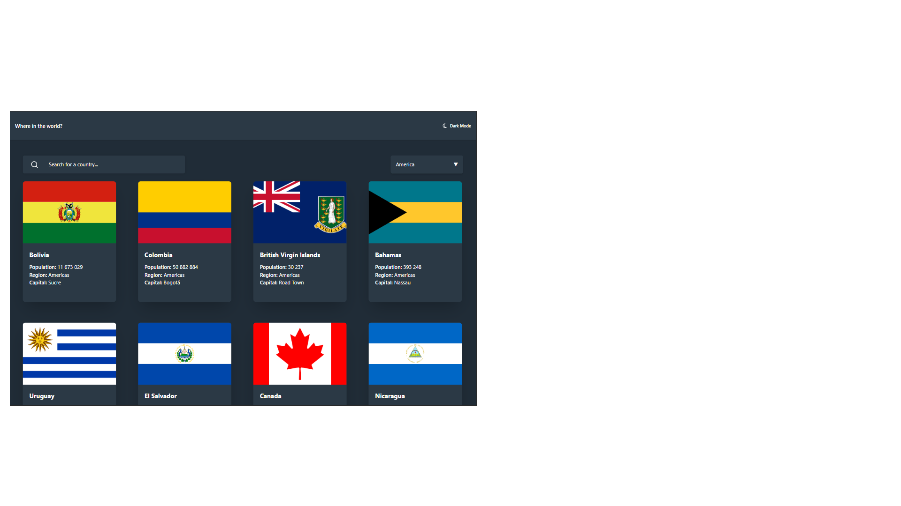

# 🌍 REST Countries API with Theme Switcher

Aplicação web feita com React que consome a [REST Countries API](https://restcountries.com/). Permite buscar países, filtrar por região, visualizar detalhes e alternar entre tema claro e escuro.

## 📸 Preview

## 🌐 Site ao vivo

[Veja o projeto funcionando aqui](https://silas310-rest-countries.netlify.app/)

## 🚀 Funcionalidades

- Busca dinâmica por nome de país
- Filtro por região (usando Radix UI)
- Exibição de detalhes do país selecionado
- Lista de países de fronteira com links
- Suporte a tema claro/escuro
- Mensagens de loading e erro
- Navegação entre páginas com React Router

## 🧠 Aprendizados

- Uso do React Router para rotas dinâmicas
- Gerenciamento de estado com hooks e SWR
- Organização de componentes reutilizáveis
- Estilização com Tailwind CSS
- Acessibilidade com Radix UI
- Boas práticas de código limpo e DRY

## 🛠️ Tecnologias

- React
- Vite
- SWR
- Tailwind CSS
- Radix UI
- React Router DOM

## 📚 Referências e Guias Utilizados

- [How to Create Dark Mode in React Without Using React Context](https://www.makeuseof.com/react-dark-mode-without-context/)
- [A Complete Guide to React Router: Everything You Need to Know](https://ui.dev/react-router-tutorial)
- [React’s Filter Component: A Comprehensive Guide](https://medium.com/%40utkarsh.gupta0311/reacts-filter-component-a-comprehensive-guide-b457a9b6dd2b)
- [Constructing Search & Filter Functionality in React 🦄](https://dev.to/laurentyson85/constructing-search-filter-functionality-in-react-dnd)